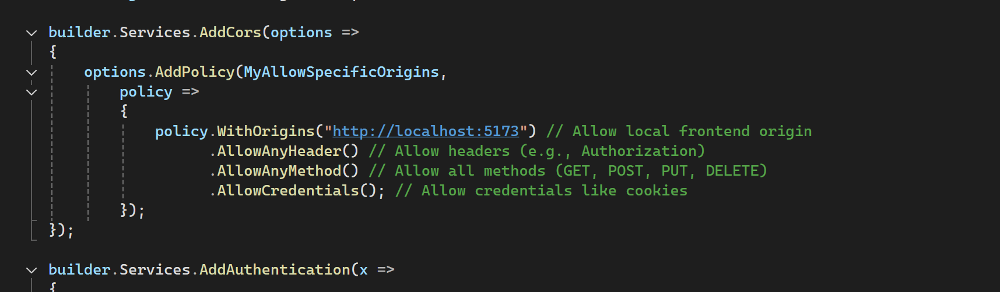
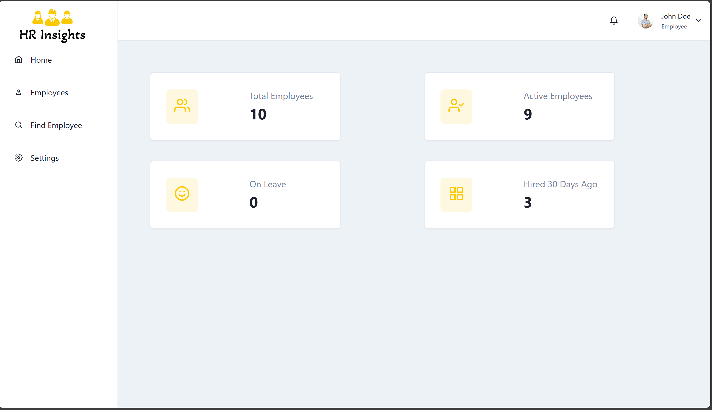
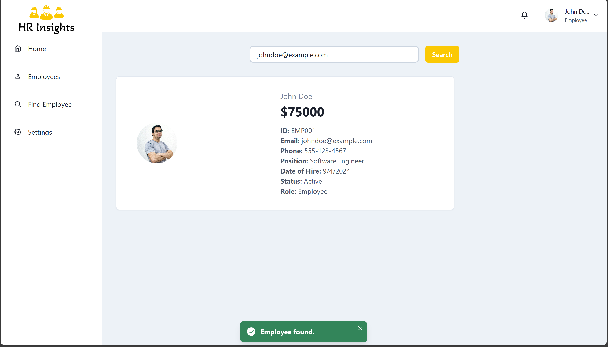
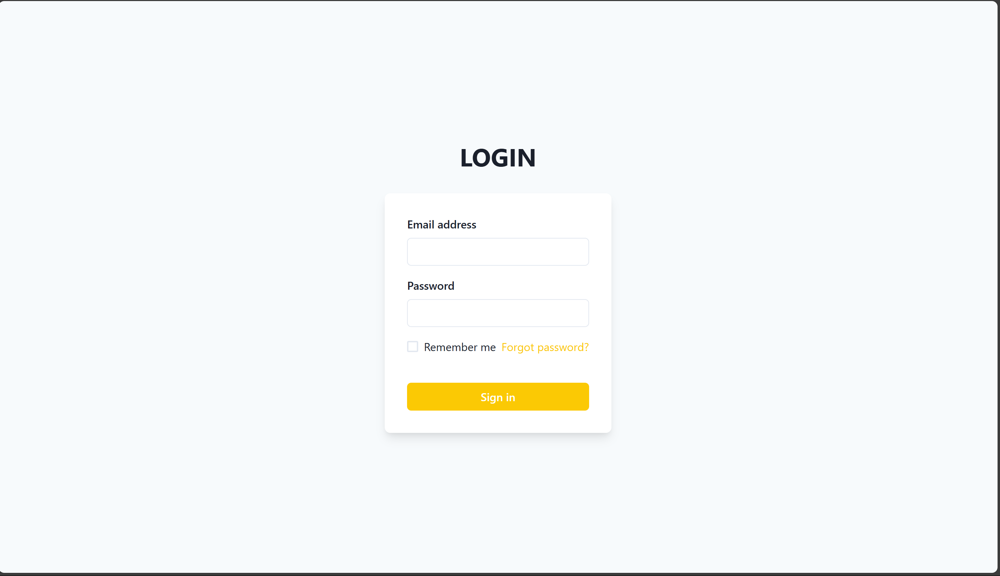
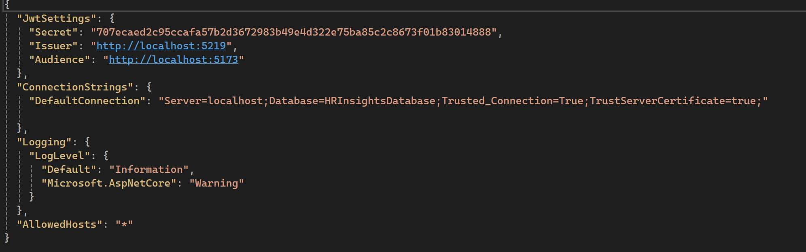

# Overview

This is a full-stack HR Insights project that allows managing employee data, including CRUD operations (Create, Read, Update, Delete), as well as file uploads for employee profile pictures. The system also supports different account roles (HR Administrator, Employee) to allow users with specific permissions to access different functionalities.

## Project Components

- Backend: .NET Core API to handle employee data, authentication, and business logic.
- Database: SQL Server for storing employee data, user accounts, and other relevant information.
- Frontend: React.js + Chakra UI application to provide an interactive UI for managing the system.

## Features

- Employee Management (CRUD)
- User Authentication
- Role-based Access Control (HR Administrator, Employee)
- File Upload for Employee Photos (Does not work)

## Getting Started

### Prerequisites

- .NET SDK 6.0 or later
- SQL Server 2019 or later
- Node.js and npm
- React.js for frontend development

### Setting Up the Backend (.NET Core)

1. Clone the repository
2. Set Up the .NET Server
3. Navigate to the backend project folder where the .csproj file is located.

4. Install the required packages:
   dotnet restore

5. Open the appsettings.json file and update the SQL Server connection string to point to your SQL Server instance:
   {
   "ConnectionStrings": {
   "DefaultConnection": "Server=your_server_name;Database=HRInsightsDatabase;Trusted_Connection=True;"
   }
   }

6. Run the migrations to set up the database schema:

- dotnet ef database update

7. Run the .NET Core server:

- dotnet run
  The server should now be running on https://localhost:5219/ (or the URL specified in launchSettings.json).

### Getting Pass CORS Error



- Ensure to enter your frontend URL

### Setting Up the SQL Server Database

1. Create Database: First, create a new SQL Server database named HRInsightsDatabase. This should have been done if the migrations were ran successfully

2. Run the Insert Statements provided in the project directory @insert_statements.sql

### Setting Up the Frontend (React.js)

1. Install Node.js Dependencies
   Navigate to the project folder and run the following commands:
   npm install

2. Start the Frontend Application
   npm run dev

### Logging in to the Application

Here are two accounts you can use to test the login functionality:

- HR Administrator Account
  Email: janesmith@example.com
  Password: hashed_password_2

- Employee Account
  Email: johndoe@example.com
  Password: hashed_password_1

These accounts have been seeded into the Users table.

### Screenshots






### How the AppSettings.json Looks



## API Documentation

HRInsights exposes several RESTful APIs for managing HR data like employee records, attendance, and authentication. Below is a detailed overview of the available endpoints.

---

### Authentication

#### **POST** `/api/auth/login/`
- **Description**: Logs in a user and returns a JWT token for authentication.
- **Request Body**:
  ```json
  {
    "username": "string",
    "password": "string"
  }
- **Response**:
   ```json
   {  
      "token": "jwt_token"
   }
- **Example**:
   ```bash
   curl -X POST http://localhost:8000/api/auth/login/ -d '{
      "username": "admin",
      "password": "password123"
   }'
#### **POST** `/api/auth/register/`
- **Description**: Registers a new user account.
- **Request Body**:
  ```json
   {
      "username": "string",
      "email": "string",
      "password": "string"
   }
- **Response**:
   ```json
   {  
      "message": "User registered successfully."
   }
- **Example**:
   ```bash
   curl -X POST http://localhost:8000/api/auth/register/ -d '{
      "username": "new_user",
      "email": "new_user@example.com",
      "password": "password123"
   }'
### Employee Management

#### **GET** `/api/employees/`
- **Description**: Retrieves a list of all employees.
- **Response**:
  ```json
  {
    "id": 1,
    "name": "John Doe",
    "position": "HR Manager",
    "email": "john.doe@example.com"
  },
  {
    "id": 2,
    "name": "Jane Smith",
    "position": "Software Engineer",
    "email": "jane.smith@example.com"
  }
- **Example**:
   ```bash
   curl -X GET http://localhost:8000/api/employees/
#### **POST** `/api/employees/`
- **Description**: Adds a new employee to the system.
- **Request Body**:
  ```json
   {
      "name": "string",
      "position": "string",
      "email": "string"
   }
- **Response**:
   ```json
   {
      "id": 3,
      "name": "Alice Johnson",
      "position": "Marketing Specialist",
      "email": "alice.johnson@example.com"
   }
- **Example**:
   ```bash
   curl -X POST http://localhost:8000/api/employees/ -d '{
      "name": "Alice Johnson",
      "position": "Marketing Specialist",
      "email": "alice.johnson@example.com"
   }'
#### **DELETE** `/api/employees/{id}/`
- **Description**: Deletes an employee with the sepecified ID.
- **Response**:
   ```json
   {
      "message": "Employee deleted successfully."
   }
- **Example**:
   ```bash
   curl -X DELETE http://localhost:8000/api/employees/1/

### Attendance Tracking

#### **POST** `/api/attendance/`
- **Description**: Records the attendance of an employee
- **Request Body**:
  ```json
  {
     "employee_id": 1,
      "date": "YYYY-MM-DD",
      "status": "present"
  }
- **Response**:
   ```json
   {  
      "message": "Attendance recorded successfully."
   }
- **Example**:
   ```bash
   curl -X POST http://localhost:8000/api/attendance/ -d '{
  "employee_id": 1,
  "date": "2023-09-23",
  "status": "present"
   }'
#### **GET** `/api/attendance/`
- **Description**: Retrieves the attendance records for all employees
- **Response**:
   ```json
  {
    "employee_id": 1,
    "date": "2023-09-23",
    "status": "present"
  },
  {
    "employee_id": 2,
    "date": "2023-09-23",
    "status": "absent"
  }
- **Example**:
   ```bash
   curl -X GET http://localhost:8000/api/attendance/
## REPORTS

#### **GET** `/api/reports/attendance/`
- **Description**: Fetches attendance reports for all employees
- **Response**:
   ```json
   {
      "employee_id": 1,
      "name": "John Doe",
      "present_days": 20,
      "absent_days": 5
  },
  {
      "employee_id": 2,
      "name": "Jane Smith",
      "present_days": 18,
      "absent_days": 7
  }
- **Example**:
   ```bash
   curl -X GET http://localhost:8000/api/reports/attendance/
### Final Notes

There are some bugs that need to be ironed out but I ran out of time

Employee Photos: Make sure that the photos are located in the public/uploads folder on your server.

Security: Ensure that password hashes are stored securely in production, and replace the sample hashed passwords with actual secure hashed values.